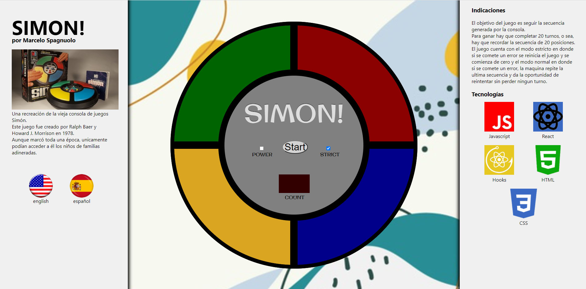
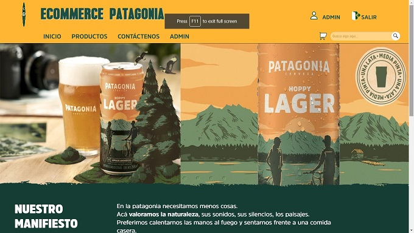
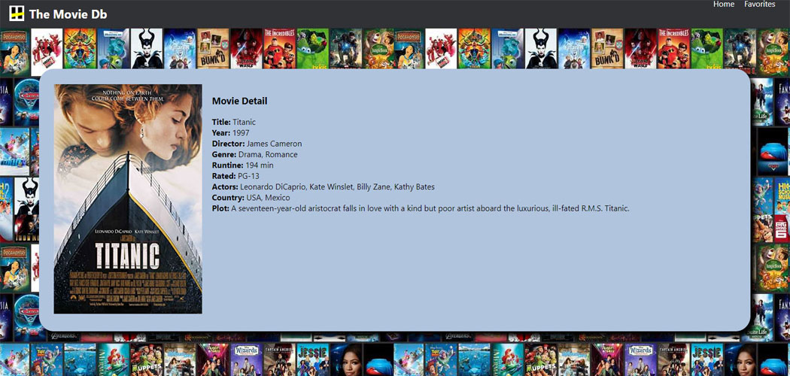
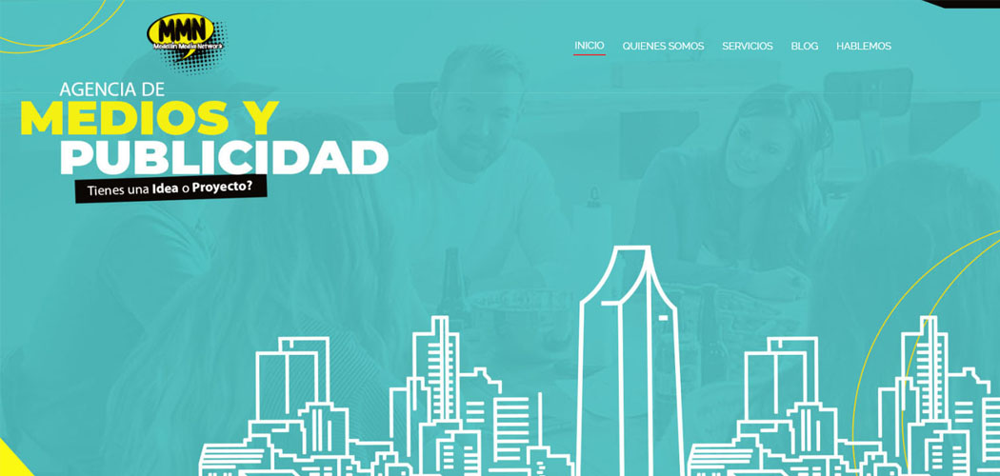
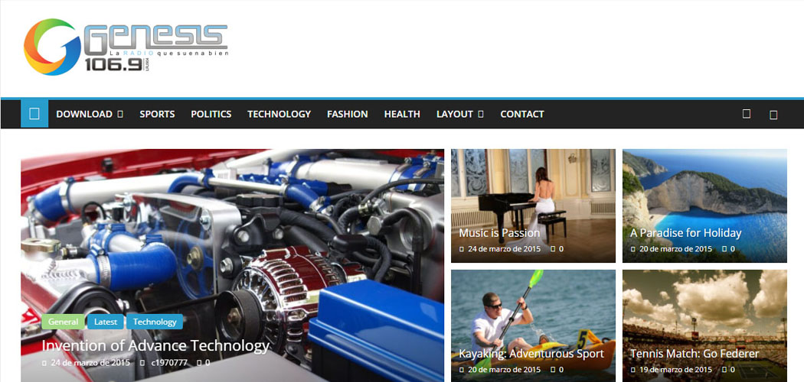
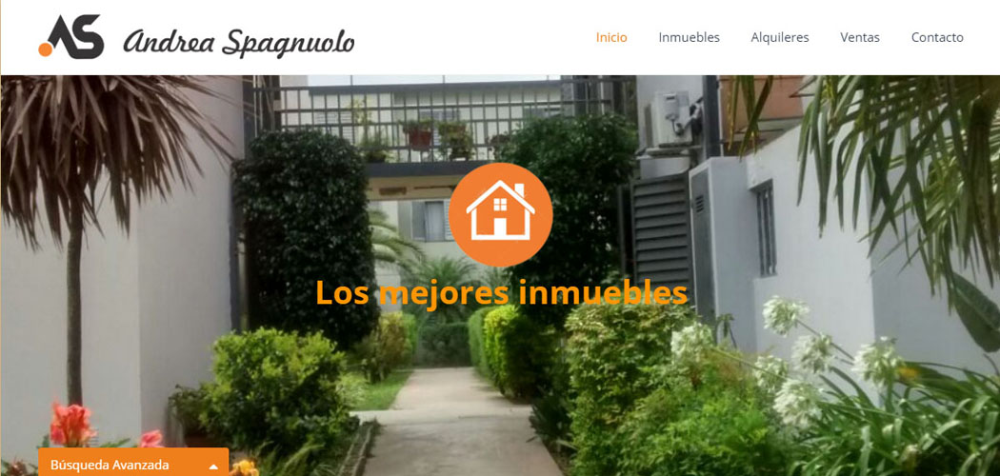
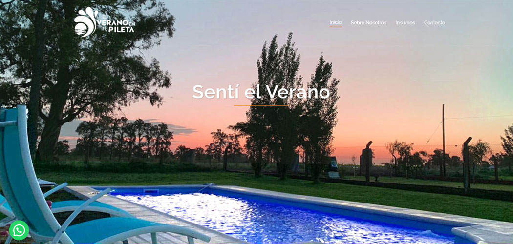

# Hi there, I'm Marcelo👋

## Full Stack Web Developer

Passionate developer... **Experience?** _My first developments were made many years before IBM discovered the potential of personal computers and commissioned Bill Gates to create the first D.O.S._

## Checkout my lastest projects

👇
👇
👇

---

## SIMON

### Recreation of an old game console to learn the implementation and creation of new hooks.

---

### 🛠️ Technologies: React, Hooks, Javascript, Html 5, Css3, React-Use, React-Router-Dom

### Visit: https://simon-marcelospagnuolo.vercel.app/

### GitHub: https://github.com/MarceloSpagnuolo/simon

---

---

## HENRY MANAGER

### Complete web application conceived both for the management of students of the academy and of the students of their own careers.

---

### 🛠️ Technologies: React, Redux, Hooks, Typescript, NodeJs, Express, Axios, Passport, Bcrypt, Mailgun, Xlxs, MongoDb, Mongoose, etc.

### GitHub: https://github.com/MarceloSpagnuolo/Proyecto-Final-ft07-04

---

---

## ECOMMERCE PATAGONIA

### A full ecommerce website about a recognize brand of beer in Argentina

---

### 🛠️ Technologies: React, Redux, Hooks, Javascript, NodeJs, Express, Axios, Passport, Bcrypt, Mailgun, Postgress, Squelize, etc.

### Visit: https://ecommerce-patagonia.vercel.app/

### GitHub: https://github.com/MarceloSpagnuolo/ecommerce_patagonia

---

---

## The Movie DB

### Personal development on a project of consultation and marking of favorite movies with all their details.

---

### 🛠️ Technologies: React, Hooks, Javascript.

### Visit: https://themoviedb-marcelospagnuolo.vercel.app/

### GitHub: https://github.com/MarceloSpagnuolo/moviedb

---

---

## Medellin Media Network

### Development of an institutional website for a media and advertising agency in the city of Medellín, Colombia.

---

### Visit: http://medellinmedianetwork.com

---

---

## Radio Genésis 106.9 y Génesis Latina 99.7

### Development of a complete news and promotions website for a multimedia company in the town of Leones, Argentina.

---

### Visit: http://lagenesis.com.ar

---

---

## Andrea Spagnuolo Real State

### Web development of management and offering of the portfolio of properties available for sale or rent in that real estate office.

---

---

---

## The Summer in your Pool

### It's a development of a website on an institutional side, added to a catalog of all the products that the owner can offer to the customer.

---

### Visit: http://elveranoentupileta.com.ar

---

---
