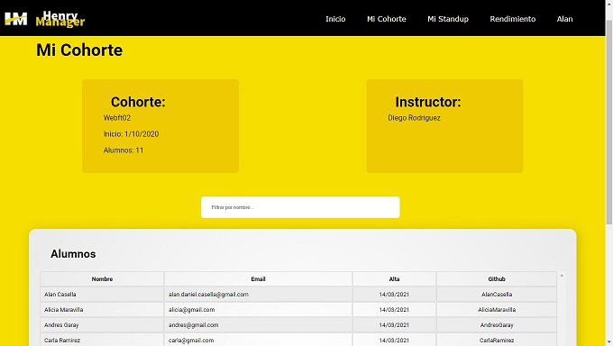

# Hi there, I'm Marcelo👋

## Full Stack Web Developer

Passionate developer... **Experience?** _My first developments were made many years before IBM discovered the potential of personal computers and commissioned Bill Gates to create the first D.O.S._

## Checkout my lastest projects

👇
👇
👇

---

## SIMON

### Recreation of an old game console to learn the implementation and creation of new hooks.

---

### 🛠️ Technologies: React, Hooks, Javascript, Html 5, Css3, React-Use, React-Router-Dom

---

## HENRY MANAGER

### Complete web application conceived both for the management of students of the academy and of the students of their own careers.

---

 
 
 

### 🛠️ Technologies: React, Redux, Hooks, Typescript, NodeJs, Express, Axios, Passport, Bcrypt, Mailgun, Xlxs, MongoDb, Mongoose, etc.

---

## ECOMMERCE PATAGONIA

### A full ecommerce website about a recognize brand of beer in Argentina

---

 
 
 

### 🛠️ Technologies: React, Redux, Hooks, Javascript, NodeJs, Express, Axios, Passport, Bcrypt, Mailgun, Postgress, Squelize, etc.
